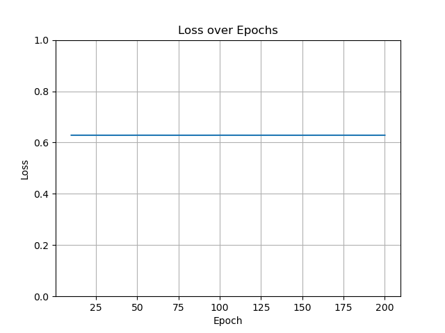
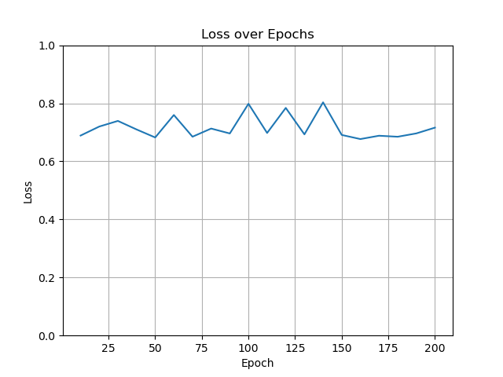
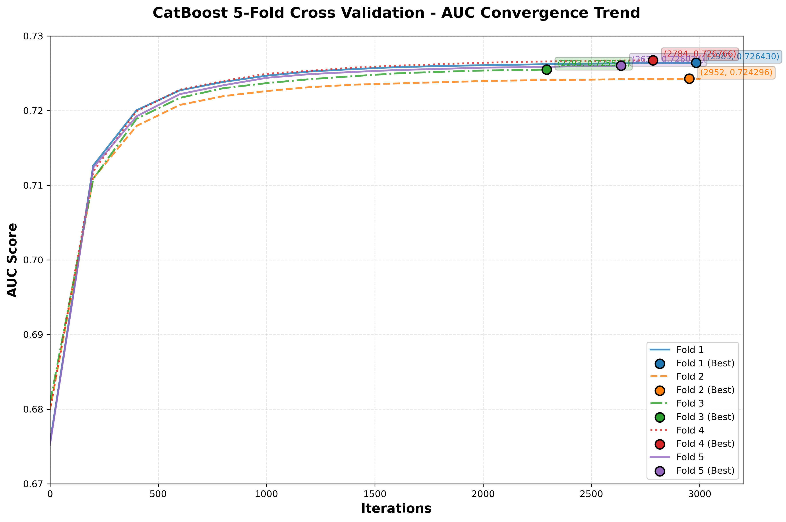
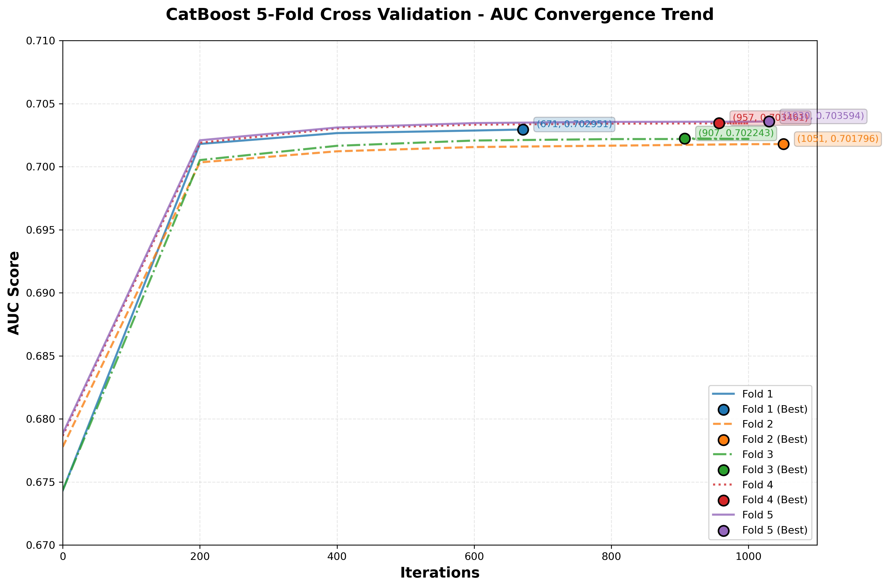
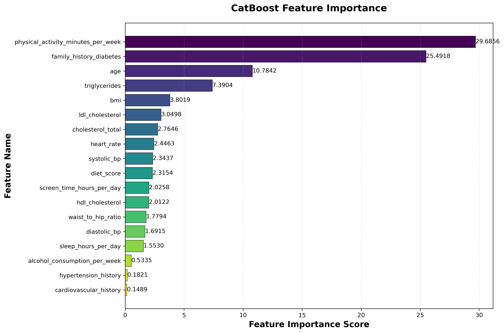

# Model

1. 尝试简单的逻辑斯蒂回归
2. 尝试决策树/随机森林等经典机器学习算法
3. 神经网络（多层感知机）
4. XGBoost/LightGBM - 当作基准

- 准确率：（（实际阳性，检测阳性）+ （实际阴性，检测阴性））/ 总人数
- 精确率：(实际阳性，检测阳性) / 检测阳性
- 召回率：（实际阳性，检测阳性）/ 实际阳性
- F1分数： 召回率和精确率的调和平均

## Phase 1

尝试了贴合比较好的几个数据进行逻辑回归和多层感知机训练，总体结果非常不好，训练损失几乎不下降，学习效果也很一般，准确率只有60%上下

这里可以看一下MLP的损失变化

- 学习率较小的时候：



```text
平均损失: 0.6277
精确率: 0.6452
召回率: 1.0000
F1分数: 0.7843
准确率: 0.6298
```

- 学习率再大一点：



```text
测试结果(设备: cuda): 
平均损失: 0.6625
精确率: 0.6250
召回率: 1.0000
F1分数: 0.7692
准确率: 0.6233
```

逻辑回归也不用看了，就基本不下降的, 我们也尝试了很多的调参，最后也没有给调出一个好的结果，基本是无法学习。

原因推测是因为我们的数据本身非常离散化，不利于深度学习进行反向传播和梯度下降

## Phase2

对随机森林的超参数进行了筛选

```text
n_estimators  max_depth  accuracy  precision    recall  f1_score
         100          5  0.628321   0.634315  0.953221  0.761737
         100         10  0.633564   0.645816  0.912584  0.756367
         100         15  0.634121   0.648275  0.902820  0.754661
         100         20  0.624707   0.651156  0.857015  0.740036
         100         25  0.605243   0.653877  0.779031  0.710988
         200          5  0.628457   0.634401  0.953255  0.761810
         200         10  0.633357   0.645858  0.911644  0.756073
         200         15  0.634200   0.648146  0.903703  0.754882
         200         20  0.624764   0.650881  0.858413  0.740379
         200         25  0.606536   0.654227  0.782079  0.712462
         300          5  0.628407   0.634289  0.953691  0.761868
         300         10  0.633007   0.645665  0.911335  0.755835
         300         15  0.634014   0.647959  0.903932  0.754835
         300         20  0.624921   0.650754  0.859513  0.740706
         300         25  0.607071   0.654431  0.783110  0.713011
         400          5  0.628314   0.634222  0.953714  0.761827
         400         10  0.633236   0.645667  0.912137  0.756112
         400         15  0.633943   0.647906  0.903932  0.754799
         400         20  0.624950   0.650656  0.860041  0.740838
         400         25  0.607221   0.654420  0.783661  0.713233
         500          5  0.628264   0.634166  0.953840  0.761827
         500         10  0.633321   0.645622  0.912664  0.756261
         500         15  0.634021   0.647962  0.903943  0.754841
         500         20  0.624757   0.650439  0.860327  0.740803
         500         25  0.607807   0.654679  0.784646  0.713795
```

1. max_depth = 5 那一组各项指标几乎原地不动，且 recall 最高（≈0.954），F1 也最高（≈0.762）。
2. 随着 depth 增大，precision 微升，但 recall 明显下降，F1 被拉低。
3. n_estimators 从 100 加到 500，指标基本 不再变化，说明树数已饱和。

选择n_estimator=200, max_depth=5 

尝试了更多的模型

| Model             | Accuracy | Precision | Recall  | F1 Score |
|-------------------|----------|-----------|---------|----------|
| Random Forest     | 0.6285   | 0.6344    | 0.9533  | 0.7618   |
| Logistic Regression| 0.6293  | 0.6414    | 0.9190  | 0.7555   |
| SVM               | 0.6233   | 0.6233    | 1.0000  | 0.7679   |
| KNN               | 0.5875   | 0.6522    | 0.7247  | 0.6865   |
| Decision Tree     | 0.5560   | 0.6493    | 0.6255  | 0.6372   |
| Naive Bayes       | 0.5761   | 0.7219    | 0.5203  | 0.6048   |
| Neural Network    | 0.6308   | 0.6429    | 0.9170  | 0.7559   |

初步分析可以发现，对于召回率而言，只有随机森林，神经网络，逻辑回归和有限向量机成功达到了90%以上，而有限向量机更是意外地达到了100%的召回率！  

0.6233 positive samples in training set.
0.6233 positive samples in test set.

> 这是模型很好吗？不，这单纯是因为一共有62.33%的数据是阳性的，只要每一个都预测是阳性，就能达到这个准确率和召回率

## KNN

对K邻居数进行了一定的筛选

| n_neighbors | Accuracy | Precision | Recall | F1 Score | Correct Probability Mean | Convince Probability Mean |
|-------------|----------|-----------|--------|----------|--------------------------|---------------------------|
| 5           | 0.5821   | 0.6530    | 0.7031 | 0.6771   | 0.5610                   | 0.7658                    |
| 15          | 0.5980   | 0.6529    | 0.7578 | 0.7015   | 0.5609                   | 0.7133                    |
| 25          | 0.6054   | 0.6530    | 0.7829 | 0.7121   | 0.5608                   | 0.6995                    |
| 35          | 0.6092   | 0.6524    | 0.7984 | 0.7181   | 0.5610                   | 0.6929                    |
| 45          | 0.6121   | 0.6519    | 0.8106 | 0.7226   | 0.5611                   | 0.6889                    |
| 55          | 0.6142   | 0.6515    | 0.8194 | 0.7259   | 0.5610                   | 0.6862                    |
| 65          | 0.6160   | 0.6513    | 0.8261 | 0.7284   | 0.5611                   | 0.6843                    |
| 75          | 0.6169   | 0.6509    | 0.8312 | 0.7301   | 0.5611                   | 0.6828                    |
| 85          | 0.6177   | 0.6505    | 0.8356 | 0.7315   | 0.5611                   | 0.6816                    |
| 95          | 0.6185   | 0.6502    | 0.8396 | 0.7329   | 0.5611                   | 0.6807                    |
| 105         | 0.6192   | 0.6501    | 0.8428 | 0.7340   | 0.5610                   | 0.6799                    |
| 115         | 0.6198   | 0.6499    | 0.8452 | 0.7348   | 0.5610                   | 0.6792                    |
| 125         | 0.6204   | 0.6499    | 0.8477 | 0.7357   | 0.5610                   | 0.6787                    |
| 135         | 0.6207   | 0.6497    | 0.8495 | 0.7363   | 0.5610                   | 0.6782                    |
| 145         | 0.6214   | 0.6498    | 0.8515 | 0.7371   | 0.5610                   | 0.6778                    |
| 155         | 0.6214   | 0.6495    | 0.8526 | 0.7374   | 0.5610                   | 0.6775                    |
| 165         | 0.6220   | 0.6496    | 0.8546 | 0.7381   | 0.5610                   | 0.6772                    |
| 175         | 0.6221   | 0.6494    | 0.8557 | 0.7384   | 0.5610                   | 0.6769                    |
| 185         | 0.6223   | 0.6493    | 0.8570 | 0.7388   | 0.5610                   | 0.6767                    |
| 195         | 0.6223   | 0.6490    | 0.8581 | 0.7390   | 0.5610                   | 0.6764                    |
| 205         | 0.6221   | 0.6487    | 0.8588 | 0.7391   | 0.5609                   | 0.6762                    |
| 215         | 0.6225   | 0.6488    | 0.8597 | 0.7395   | 0.5609                   | 0.6761                    |
| 225         | 0.6227   | 0.6487    | 0.8608 | 0.7399   | 0.5609                   | 0.6759                    |
| 235         | 0.6226   | 0.6486    | 0.8612 | 0.7399   | 0.5609                   | 0.6757                    |
| 245         | 0.6231   | 0.6487    | 0.8622 | 0.7404   | 0.5609                   | 0.6756                    |
| 255         | 0.6233   | 0.6487    | 0.8631 | 0.7407   | 0.5609                   | 0.6754                    |
| 265         | 0.6232   | 0.6484    | 0.8638 | 0.7408   | 0.5609                   | 0.6753                    |
| 275         | 0.6231   | 0.6483    | 0.8639 | 0.7407   | 0.5609                   | 0.6752                    |
| 285         | 0.6233   | 0.6483    | 0.8646 | 0.7410   | 0.5609                   | 0.6751                    |
| 295         | 0.6234   | 0.6483    | 0.8650 | 0.7411   | 0.5608                   | 0.6750                    |

---

## Phase2总结

这几个模型的表现都很糟糕说实话，准确率都比较低，有些甚至有基本啥也没学到的情况

## 规划

准备`XGBoost`, `LightGBM`的部署，并且学习其他参赛者的模型

## Phase3

| 模型 | Accuracy | Precision | Recall | F1 Score | Correct Probability Mean | Convince Probability Mean |
|------|----------|-----------|--------|----------|--------------------------|---------------------------|
| XGBoost | 0.6367 | 0.6496 | 0.9057 | 0.7565 | 0.5630 | 0.6362 |
| LightGBM | 0.6368 | 0.6499 | 0.9045 | 0.7563 | 0.5630 | 0.6363 |

节点无法通过分裂实现有效优化，这是没有调参的版本，说实话表现很一般，甚至不如全猜阳性，先前我们认为，只取部分数据\['bmi','waist_to_hip_ratio','cholesterol_total','triglycerides','family_history_diabetes','diagnosed_diabetes'\]，这些关联度更大的数据会有比较好的结果，但是最后反映出来的是，我们的模型表现很烂，因此我们放弃这样的做法，尝试使用更多的数据列。

## Phase4

用全部的数据直接输入XGBoost模型训练得到结果

移除了部分数据列，发现基本没有影响

| 评估指标         | XGBoost | LightGBM | Catboost |
| :---------------- | :------ | :------- | :------- |
| 准确率（Accuracy） | 0.6832  | 0.6834   | 0.6803   |
| 精确率（Precision） | 0.7056  | 0.7072   | 0.7006   |
| 召回率（Recall）   | 0.8449  | 0.8410   | 0.8518   |
| F1 分数（F1-Score） | 0.7690  | 0.7683   | 0.7688   |
| ROC AUC 分数      | 0.7241  | 0.7238   | 0.7218   |

感觉是比之前的结果明显好一点

> 感受就是，在机器学习中，喂完整的，特征更多的数据还是很有必要的，这样能帮助你回归出更好的结果。

说实话到这里我感觉已经走到头了，没什么好调参的地方了，要不就这样子总结总结完事吧？
其实我还是不太甘心，，因为我们的准确率始终连70都到不了, kaggle提交最后得分只有0.60左右，说实话调参也没有什么好调的，它基本就这个层次了。

> 代码存在[run.ipynb](run.ipynb)中

## Phase5

引入KFold

我们修改了大量代码，引入了5折交叉验证，我们在5次训练中每次都选取最好的模型，然后将其对其五次训练结果取平均

| 评估指标         | CatBoost | LightGBM |
| :---------------- | :------- | :------- |
| 准确率（Accuracy） | 0.6832   | 0.6842   |
| 精确率（Precision） | 0.7057   | 0.7089   |
| 召回率（Recall）   | 0.8435   | 0.8369   |
| F1 分数（F1-Score） | 0.7685   | 0.7676   |
| ROC AUC           | 0.7255   | 0.7267   |
| 预测的自信程度     | -        | 0.6244   |

结果我们发现这个模型本身的表现实际上相比Phase4提出的结果没有更大的突破， KFold并没有能优化我们的模型到更好的程度

接下来尝试分箱操作，同时要尝试排名概率

- 发现了一个非常意外的事情，我们实际上错误地把id代进去跑了，最后呈现出来的结果是预测的自信程度更高了，但是准确率更低了

- 纠正了这个小错误，并且引入了分箱和排名概率后的结果为

| 评估指标         | CatBoost | LightGBM |
| :---------------- | :------- | :------- |
| 准确率（Accuracy） | 0.6533   | 0.6530   |
| 精确率（Precision） | 0.6681   | 0.6683   |
| 召回率（Recall）   | 0.8816   | 0.8798   |
| F1 分数（F1-Score） | 0.7602   | 0.7596   |
| ROC AUC           | 0.6778   | 0.6774   |
| 预测的自信程度     | 0.6102   | 0.6102   |

## Phase 6

至少到现在为止我的感受是，似乎在模型逐渐精美，逐渐完善后，比起模型的进一步优化，更要去看数据是否清晰

又犯了个错误，concat测试的时候不小心没有把索引匹配一致

- 调显著性水平，
- 调箱数（n_bins）：如 KBinsDiscretizer 的n_bins，可调范围一般 5~10，箱数过多易过拟合、过少易丢失特征信息；
- 分箱策略（strategy）：可选 “quantile”（等频）、“uniform”（等距）、“kmeans”（聚类分箱），针对偏态数据优先调为 “quantile”，均匀分布数据可用 “uniform”；
- 学习率

- 训练个神经网络

接下来继续训练个神经网络和随机森林，并且稍微调整下分箱相关的

- 分箱操作是否有用，对比
- 排名概率 or 归一化
- 各个模型的比较
- 模型的结合是否有用
- 不同参数的分析
- KFold的作用，对比

## 总结

模型基本没有什么优化的空间和能力了，说实话

### 分箱

我们对数据进行了一次分箱操作，这个操作的主要目的是把原本较为连续的数据进行分组，尝试让我们基于决策树的模型能更好地提取特征。

表现如何呢？我们以Catboost为例，阐述分箱的作用

| 分箱箱数（n_bins） | 分箱策略（strategy） | 准确率 | 精确率 | 召回率 | F1 分数 | ROC AUC |
| :----------------- | :------------------- | :----- | :----- | :----- | :------ | :------ |
| -（无分箱）        | -（无分箱）          | 0.6834 | 0.7062 | 0.8427 | 0.7684  | 0.7258  |
| 5                  | uniform              | 0.6532 | 0.6681 | 0.8818 | 0.7602  | 0.6779  |
| 10                 | uniform              | 0.6649 | 0.6861 | 0.8525 | 0.7603  | 0.6963  |
| 15                 | uniform              | 0.6631 | 0.6815 | 0.8626 | 0.7615  | 0.6942  |
| 20                 | uniform              | 0.6658 | 0.6863 | 0.8543 | 0.7611  | 0.6984  |
| 5                  | quantile             | 0.6604 | 0.6835 | 0.8476 | 0.7568  | 0.6903  |
| 10                 | quantile             | 0.6649 | 0.6861 | 0.8524 | 0.7603  | 0.6963  |
| 15                 | quantile             | 0.6670 | 0.6892 | 0.8485 | 0.7606  | 0.7009  |
| 20                 | quantile             | 0.6681 | 0.6898 | 0.8498 | 0.7614  | 0.7028  |

无分箱时的迭代图：


进行分箱后：


1.  **无分箱性能最优**：无分箱时模型在准确率（0.6834）、精确率（0.7062）、F1分数（0.7684）、ROC AUC（0.7258）上均大幅领先所有分箱方案，说明当前数据集的连续特征无需分箱即可保留最优区分度，分箱操作反而损失了部分特征信息；
2.  **分箱策略对比**：`quantile`（等频）分箱仍优于`uniform`（等距）分箱，最优分箱组合（20-quantile）的ROC AUC（0.7028）虽低于无分箱，但远高于最差分箱组合（5-uniform，0.6779）；
3.  **箱数影响趋势**：分箱箱数从5增加到20时，性能逐步提升但始终不及无分箱，箱数超过15后提升幅度趋缓；
4.  **模型收敛速度**: 可以看出分箱后确实能大幅加快模型的训练速度，减少迭代轮次

### 排名概率 VS 归一化

我们在思考模型和模型的结合，提高预测能力，我们有两个思路，一是使用排名概率，二是采用归一化，来看一下吧

| 评估指标         | 集成模型（未归一化） | 集成模型（归一化后） | CatBoost模型 |
| :---------------- | :------------------- | :------------------- | :----------- |
| 准确率（Accuracy） | 0.6533               | 0.6829               | 0.6835       |
| 精确率（Precision） | 0.7766               | 0.7177               | 0.7063       |
| 召回率（Recall）   | 0.6229               | 0.8097               | 0.8427       |
| F1 分数（F1-Score） | 0.6913               | 0.7609               | 0.7685       |
| ROC AUC           | 0.7251               | 0.7251               | 0.7258       |

1. 归一化实现了精确率与召回率的显著权衡
- 未归一化模型的核心优势是高精确率（0.7766），但代价是召回率极低（0.6229），模型倾向于 “少预测正例，避免误判”，适合对假阳性严格管控的场景（如高价值商品风控）。
- 归一化后模型牺牲了 0.0589 的精确率，换来了 0.1868 的召回率大幅提升，模型从 “保守预测” 转向 “全面识别正例”，更适合需要兼顾识别率的通用分类场景。
2. 归一化显著提升模型综合性能
- 准确率提升 0.0296，F1 分数提升 0.0696，说明归一化消除了不同基模型输出的尺度差异，让集成融合的权重分配更合理，直接改善了模型的整体分类效果。
- ROC AUC 保持不变（0.7251） 是关键亮点：这说明归一化仅调整了模型输出的 “决策阈值” 附近的分布，没有改变模型对正负样本的核心区分能力，验证了归一化是无信息损失的有效预处理手段。
3. 与单一 CatBoost 模型的对标参考
- 归一化后的集成模型准确率（0.6829）和 CatBoost 几乎持平，F1 分数（0.7609）略低，ROC AUC（0.7251）接近；
- 集成模型的价值在于稳定性（多模型融合降低过拟合风险），而归一化是让集成模型性能逼近甚至超越单一最优模型的关键步骤。

### 比较模型表现

我们测试的模型主要有以下五种

1. XGBoost
2. CatBoost
3. LightGBM
4. RandomForest
5. MLP

简单把他们最佳参数版本放上来比较吧！其中只有MLP是没有经过5折交叉验证的，因为真的太慢了！！！
| 模型名称                | 准确率 | 精确率 | 召回率 | F1 分数 | ROC AUC |
| :---------------------- | :----- | :----- | :----- | :------ | :------ |
| Neural Network          | 0.6656 | 0.6844 | 0.8602 | 0.7623  | 0.6960  |
| Random Forest           | 0.6661 | 0.6785 | 0.8823 | 0.7671  | 0.6993  |
| XGBoost                 | 0.6764 | 0.6939 | 0.8602 | 0.7682  | 0.7156  |
| LightGBM                | 0.6818 | 0.7027 | 0.8485 | 0.7687  | 0.7230  |
| CatBoost                | 0.6835 | 0.7063 | 0.8427 | 0.7685  | 0.7258  |

1.  **集成学习模型表现更优**：XGBoost、LightGBM、CatBoost（树基集成模型）的各项指标全面领先于神经网络和随机森林，体现了集成学习在该分类任务上的优势；
2.  **CatBoost性能登顶**：CatBoost在准确率（0.6835）、精确率（0.7063）、ROC AUC（0.7258）上均为最优，综合性能最佳；
3.  **LightGBM F1分数最优**：LightGBM的F1分数（0.7687）略高于CatBoost，在精确率和召回率的平衡上表现出色；
4.  **随机森林召回率突出**：Random Forest的召回率（0.8823）为所有模型中最高，适合对少数类识别要求较高的场景，但精确率相对偏低。

### KFold的作用

我们尝试通过多折交叉验证，提高训练稳定性，以Catboost为例，我们来对比一下

| 评估指标         | 5折交叉验证 | 不交叉验证（单一划分） | 差异（交叉 - 不交叉） |
| :---------------- | :---------- | :--------------------- | :-------------------- |
| 准确率（Accuracy） | 0.6833      | 0.6829                 | +0.0004                |
| 精确率（Precision） | 0.7060      | 0.7057                 | +0.0003                |
| 召回率（Recall）   | 0.8428      | 0.8427                 | +0.0001                |
| F1 分数（F1-Score） | 0.7684      | 0.7681                 | +0.0003                |
| ROC AUC           | 0.7258      | 0.7252                 | +0.0006                |

二者差距没有很大

### 部分参数的调整

在我调参的过程中实际上感觉到，模型的参数实际上调整空间相当有限，调来调去实际上对模型性能的改变是较为有限的。  
更重要的还是ALPHA，也就是高于多少就认为它阳性。

- 表1：ALPHA = 0.4 时各模型性能对比表

| 模型名称                          | 准确率  | 精确率  | 召回率  | F1 分数  | ROC AUC  |
| :-------------------------------- | :------ | :------ | :------ | :------- | :------- |
| CatBoost Classifier               | 0.6684  | 0.6650  | 0.9430  | 0.7800   | 0.7252   |
| LightGBM Classifier               | 0.6651  | 0.6610  | 0.9498  | 0.7795   | 0.7230   |
| XGBoost Classifier                | 0.6578  | 0.6534  | 0.9606  | 0.7777   | 0.7155   |
| Random Forest Classifier          | 0.6449  | 0.6408  | 0.9792  | 0.7747   | 0.6998   |
| Ensemble Model (排名概率)         | 0.6745  | 0.7482  | 0.7200  | 0.7339   | 0.7253   |
| Ensemble Model (归一化) | 0.6756  | 0.6775  | 0.9152  | 0.7786   | 0.7240   |

- 表2：ALPHA = 0.6 时各模型性能对比表

| 模型名称                          | 准确率  | 精确率  | 召回率  | F1 分数  | ROC AUC  |
| :-------------------------------- | :------ | :------ | :------ | :------- | :------- |
| CatBoost Classifier               | 0.6654  | 0.7609  | 0.6754  | 0.7156   | 0.7252   |
| LightGBM Classifier               | 0.6643  | 0.7604  | 0.6738  | 0.7145   | 0.7230   |
| XGBoost Classifier                | 0.6570  | 0.7561  | 0.6638  | 0.7070   | 0.7155   |
| Random Forest Classifier          | 0.6429  | 0.7431  | 0.6528  | 0.6950   | 0.6998   |
| Ensemble Model (排名概率)         | 0.6213  | 0.8062  | 0.5166  | 0.6297   | 0.7253   |
| Ensemble Model (归一化) | 0.6553  | 0.7720  | 0.6343  | 0.6964   | 0.7239   |

1. ALPHA=0.4 是更优选型：该配置下所有模型性能更均衡，尤其召回率大幅提升，F1 分数更优，更适合需要兼顾正例识别率的通用分类场景；ALPHA=0.6 仅适用于对精确率要求极高、可容忍高漏判率的小众场景（如高风险欺诈拦截）。
2. CatBoost 是最优单一模型：在两种 ALPHA 配置下均保持性能领先，兼具稳定性和高效性，是单一模型选型的首选。
3. 归一化是集成融合的必要步骤：能有效改善集成模型的性能失衡问题，让集成模型逼近甚至超越单一最优模型，实现融合价值。
4. 集成模型的优势在优质配置下更显著：仅在 ALPHA=0.4（模型整体性能优）时，归一化集成模型才能体现出 “准确率略高、稳定性更强” 的融合优势；在劣质配置下，集成融合难以逆转性能劣势。

- k的调整

```python
validation_df["final_preds"] = k * validation_df["cat_rank"] + (1 - k) * validation_df["lgb_rank"]
```
**表1：不同k值（未归一化集成模型）性能对比表**
| k值   | 准确率  | 精确率  | 召回率  | F1 分数  | ROC AUC  |
| :----- | :------ | :------ | :------ | :------- | :------- |
| 0.4    | 0.6740  | 0.7476  | 0.7200  | 0.7336   | 0.7248   |
| 0.5    | 0.6742  | 0.7478  | 0.7202  | 0.7337   | 0.7251   |
| 0.6    | 0.6742  | 0.7478  | 0.7203  | 0.7338   | 0.7253   |
| 0.7    | 0.6742  | 0.7479  | 0.7199  | 0.7337   | 0.7254   |
| 0.8    | 0.6743  | 0.7480  | 0.7200  | 0.7337   | 0.7254   |

**表2：不同k值（归一化集成模型）性能对比表**
| k值   | 准确率  | 精确率  | 召回率  | F1 分数  | ROC AUC  |
| :----- | :------ | :------ | :------ | :------- | :------- |
| 0.2    | 0.6758  | 0.6778  | 0.9149  | 0.7787   | 0.7240   |
| 0.3    | 0.6756  | 0.6771  | 0.9167  | 0.7789   | 0.7244   |
| 0.4    | 0.6751  | 0.6763  | 0.9182  | 0.7789   | 0.7248   |
| 0.5    | 0.6746  | 0.6755  | 0.9197  | 0.7789   | 0.7251   |
| 0.6    | 0.6747  | 0.6752  | 0.9214  | 0.7793   | 0.7253   |
| 0.7    | 0.6745  | 0.6745  | 0.9233  | 0.7795   | 0.7254   |
| 0.8    | 0.6742  | 0.6740  | 0.9245  | 0.7796   | 0.7254   |

### 各个特征重要性



### Submission

最后我们提交了预测结果，拿到0.63399的评分
