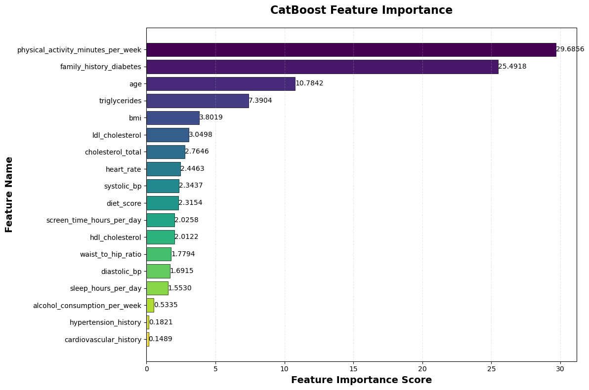

```python
import numpy as np
import pandas as pd
import torch
from sklearn.ensemble import RandomForestClassifier
from sklearn.metrics import accuracy_score, precision_score, recall_score, f1_score, roc_auc_score
from sklearn.model_selection import train_test_split
from sklearn.preprocessing import StandardScaler
import matplotlib.pyplot as plt
from sklearn.ensemble import RandomForestClassifier
from sklearn.linear_model import LogisticRegression
from sklearn.svm import SVC
from sklearn.neighbors import KNeighborsClassifier
from sklearn.tree import DecisionTreeClassifier
from sklearn.naive_bayes import GaussianNB
from sklearn.neural_network import MLPClassifier
from xgboost import XGBClassifier
from lightgbm import LGBMClassifier
from catboost import CatBoostClassifier
from sklearn.model_selection import StratifiedKFold

```


```python
ALPHA = 0.4
```


```python
train_data = pd.read_csv('data/train.csv', index_col='id')
train_data.columns
```


    Index(['age', 'alcohol_consumption_per_week',
           'physical_activity_minutes_per_week', 'diet_score',
           'sleep_hours_per_day', 'screen_time_hours_per_day', 'bmi',
           'waist_to_hip_ratio', 'systolic_bp', 'diastolic_bp', 'heart_rate',
           'cholesterol_total', 'hdl_cholesterol', 'ldl_cholesterol',
           'triglycerides', 'gender', 'ethnicity', 'education_level',
           'income_level', 'smoking_status', 'employment_status',
           'family_history_diabetes', 'hypertension_history',
           'cardiovascular_history', 'diagnosed_diabetes'],
          dtype='object')


```python
features = train_data.drop('diagnosed_diabetes', axis=1)
labels = train_data['diagnosed_diabetes'].astype(int)

features.head()
```


<div>
<style scoped>
    .dataframe tbody tr th:only-of-type {
        vertical-align: middle;
    }

    .dataframe tbody tr th {
        vertical-align: top;
    }

    .dataframe thead th {
        text-align: right;
    }
</style>
<table border="1" class="dataframe">
  <thead>
    <tr style="text-align: right;">
      <th></th>
      <th>age</th>
      <th>alcohol_consumption_per_week</th>
      <th>physical_activity_minutes_per_week</th>
      <th>diet_score</th>
      <th>sleep_hours_per_day</th>
      <th>screen_time_hours_per_day</th>
      <th>bmi</th>
      <th>waist_to_hip_ratio</th>
      <th>systolic_bp</th>
      <th>diastolic_bp</th>
      <th>...</th>
      <th>triglycerides</th>
      <th>gender</th>
      <th>ethnicity</th>
      <th>education_level</th>
      <th>income_level</th>
      <th>smoking_status</th>
      <th>employment_status</th>
      <th>family_history_diabetes</th>
      <th>hypertension_history</th>
      <th>cardiovascular_history</th>
    </tr>
    <tr>
      <th>id</th>
      <th></th>
      <th></th>
      <th></th>
      <th></th>
      <th></th>
      <th></th>
      <th></th>
      <th></th>
      <th></th>
      <th></th>
      <th></th>
      <th></th>
      <th></th>
      <th></th>
      <th></th>
      <th></th>
      <th></th>
      <th></th>
      <th></th>
      <th></th>
      <th></th>
    </tr>
  </thead>
  <tbody>
    <tr>
      <th>0</th>
      <td>31</td>
      <td>1</td>
      <td>45</td>
      <td>7.7</td>
      <td>6.8</td>
      <td>6.1</td>
      <td>33.4</td>
      <td>0.93</td>
      <td>112</td>
      <td>70</td>
      <td>...</td>
      <td>102</td>
      <td>Female</td>
      <td>Hispanic</td>
      <td>Highschool</td>
      <td>Lower-Middle</td>
      <td>Current</td>
      <td>Employed</td>
      <td>0</td>
      <td>0</td>
      <td>0</td>
    </tr>
    <tr>
      <th>1</th>
      <td>50</td>
      <td>2</td>
      <td>73</td>
      <td>5.7</td>
      <td>6.5</td>
      <td>5.8</td>
      <td>23.8</td>
      <td>0.83</td>
      <td>120</td>
      <td>77</td>
      <td>...</td>
      <td>124</td>
      <td>Female</td>
      <td>White</td>
      <td>Highschool</td>
      <td>Upper-Middle</td>
      <td>Never</td>
      <td>Employed</td>
      <td>0</td>
      <td>0</td>
      <td>0</td>
    </tr>
    <tr>
      <th>2</th>
      <td>32</td>
      <td>3</td>
      <td>158</td>
      <td>8.5</td>
      <td>7.4</td>
      <td>9.1</td>
      <td>24.1</td>
      <td>0.83</td>
      <td>95</td>
      <td>89</td>
      <td>...</td>
      <td>108</td>
      <td>Male</td>
      <td>Hispanic</td>
      <td>Highschool</td>
      <td>Lower-Middle</td>
      <td>Never</td>
      <td>Retired</td>
      <td>0</td>
      <td>0</td>
      <td>0</td>
    </tr>
    <tr>
      <th>3</th>
      <td>54</td>
      <td>3</td>
      <td>77</td>
      <td>4.6</td>
      <td>7.0</td>
      <td>9.2</td>
      <td>26.6</td>
      <td>0.83</td>
      <td>121</td>
      <td>69</td>
      <td>...</td>
      <td>123</td>
      <td>Female</td>
      <td>White</td>
      <td>Highschool</td>
      <td>Lower-Middle</td>
      <td>Current</td>
      <td>Employed</td>
      <td>0</td>
      <td>1</td>
      <td>0</td>
    </tr>
    <tr>
      <th>4</th>
      <td>54</td>
      <td>1</td>
      <td>55</td>
      <td>5.7</td>
      <td>6.2</td>
      <td>5.1</td>
      <td>28.8</td>
      <td>0.90</td>
      <td>108</td>
      <td>60</td>
      <td>...</td>
      <td>124</td>
      <td>Male</td>
      <td>White</td>
      <td>Highschool</td>
      <td>Upper-Middle</td>
      <td>Never</td>
      <td>Retired</td>
      <td>0</td>
      <td>1</td>
      <td>0</td>
    </tr>
  </tbody>
</table>
<p>5 rows × 24 columns</p>
</div>


```python
DROP_COLUMNS = ['gender', 'ethnicity', 'education_level', 'income_level', 'smoking_status', 'employment_status']
features = features.drop(columns=DROP_COLUMNS, axis=1)
features.head()
```


<div>
<style scoped>
    .dataframe tbody tr th:only-of-type {
        vertical-align: middle;
    }

    .dataframe tbody tr th {
        vertical-align: top;
    }

    .dataframe thead th {
        text-align: right;
    }
</style>
<table border="1" class="dataframe">
  <thead>
    <tr style="text-align: right;">
      <th></th>
      <th>age</th>
      <th>alcohol_consumption_per_week</th>
      <th>physical_activity_minutes_per_week</th>
      <th>diet_score</th>
      <th>sleep_hours_per_day</th>
      <th>screen_time_hours_per_day</th>
      <th>bmi</th>
      <th>waist_to_hip_ratio</th>
      <th>systolic_bp</th>
      <th>diastolic_bp</th>
      <th>heart_rate</th>
      <th>cholesterol_total</th>
      <th>hdl_cholesterol</th>
      <th>ldl_cholesterol</th>
      <th>triglycerides</th>
      <th>family_history_diabetes</th>
      <th>hypertension_history</th>
      <th>cardiovascular_history</th>
    </tr>
    <tr>
      <th>id</th>
      <th></th>
      <th></th>
      <th></th>
      <th></th>
      <th></th>
      <th></th>
      <th></th>
      <th></th>
      <th></th>
      <th></th>
      <th></th>
      <th></th>
      <th></th>
      <th></th>
      <th></th>
      <th></th>
      <th></th>
      <th></th>
    </tr>
  </thead>
  <tbody>
    <tr>
      <th>0</th>
      <td>31</td>
      <td>1</td>
      <td>45</td>
      <td>7.7</td>
      <td>6.8</td>
      <td>6.1</td>
      <td>33.4</td>
      <td>0.93</td>
      <td>112</td>
      <td>70</td>
      <td>62</td>
      <td>199</td>
      <td>58</td>
      <td>114</td>
      <td>102</td>
      <td>0</td>
      <td>0</td>
      <td>0</td>
    </tr>
    <tr>
      <th>1</th>
      <td>50</td>
      <td>2</td>
      <td>73</td>
      <td>5.7</td>
      <td>6.5</td>
      <td>5.8</td>
      <td>23.8</td>
      <td>0.83</td>
      <td>120</td>
      <td>77</td>
      <td>71</td>
      <td>199</td>
      <td>50</td>
      <td>121</td>
      <td>124</td>
      <td>0</td>
      <td>0</td>
      <td>0</td>
    </tr>
    <tr>
      <th>2</th>
      <td>32</td>
      <td>3</td>
      <td>158</td>
      <td>8.5</td>
      <td>7.4</td>
      <td>9.1</td>
      <td>24.1</td>
      <td>0.83</td>
      <td>95</td>
      <td>89</td>
      <td>73</td>
      <td>188</td>
      <td>59</td>
      <td>114</td>
      <td>108</td>
      <td>0</td>
      <td>0</td>
      <td>0</td>
    </tr>
    <tr>
      <th>3</th>
      <td>54</td>
      <td>3</td>
      <td>77</td>
      <td>4.6</td>
      <td>7.0</td>
      <td>9.2</td>
      <td>26.6</td>
      <td>0.83</td>
      <td>121</td>
      <td>69</td>
      <td>74</td>
      <td>182</td>
      <td>54</td>
      <td>85</td>
      <td>123</td>
      <td>0</td>
      <td>1</td>
      <td>0</td>
    </tr>
    <tr>
      <th>4</th>
      <td>54</td>
      <td>1</td>
      <td>55</td>
      <td>5.7</td>
      <td>6.2</td>
      <td>5.1</td>
      <td>28.8</td>
      <td>0.90</td>
      <td>108</td>
      <td>60</td>
      <td>85</td>
      <td>206</td>
      <td>49</td>
      <td>131</td>
      <td>124</td>
      <td>0</td>
      <td>1</td>
      <td>0</td>
    </tr>
  </tbody>
</table>
</div>


```python
# skf = StratifiedKFold(n_splits=5, shuffle=True, random_state=42)
params = {
    "loss_function": "Logloss",
    "eval_metric": "AUC",
    "iterations": 4000,
    "learning_rate": 0.05,
    "depth": 6,
    "l2_leaf_reg": 6,
    "random_strength": 1.0,
    "bootstrap_type": "Bayesian",
    "bagging_temperature": 0.8,
    "min_data_in_leaf": 50,
    "random_seed": 42,
    "verbose": 200,
    "task_type": "GPU"   # TURN GPU ON
}
test_data = pd.read_csv('data/test.csv', index_col='id').drop(DROP_COLUMNS, axis=1)
test_data.head()
```


<div>
<style scoped>
    .dataframe tbody tr th:only-of-type {
        vertical-align: middle;
    }

    .dataframe tbody tr th {
        vertical-align: top;
    }

    .dataframe thead th {
        text-align: right;
    }
</style>
<table border="1" class="dataframe">
  <thead>
    <tr style="text-align: right;">
      <th></th>
      <th>age</th>
      <th>alcohol_consumption_per_week</th>
      <th>physical_activity_minutes_per_week</th>
      <th>diet_score</th>
      <th>sleep_hours_per_day</th>
      <th>screen_time_hours_per_day</th>
      <th>bmi</th>
      <th>waist_to_hip_ratio</th>
      <th>systolic_bp</th>
      <th>diastolic_bp</th>
      <th>heart_rate</th>
      <th>cholesterol_total</th>
      <th>hdl_cholesterol</th>
      <th>ldl_cholesterol</th>
      <th>triglycerides</th>
      <th>family_history_diabetes</th>
      <th>hypertension_history</th>
      <th>cardiovascular_history</th>
    </tr>
    <tr>
      <th>id</th>
      <th></th>
      <th></th>
      <th></th>
      <th></th>
      <th></th>
      <th></th>
      <th></th>
      <th></th>
      <th></th>
      <th></th>
      <th></th>
      <th></th>
      <th></th>
      <th></th>
      <th></th>
      <th></th>
      <th></th>
      <th></th>
    </tr>
  </thead>
  <tbody>
    <tr>
      <th>700000</th>
      <td>45</td>
      <td>4</td>
      <td>100</td>
      <td>4.3</td>
      <td>6.8</td>
      <td>6.2</td>
      <td>25.5</td>
      <td>0.84</td>
      <td>123</td>
      <td>70</td>
      <td>64</td>
      <td>209</td>
      <td>55</td>
      <td>135</td>
      <td>111</td>
      <td>0</td>
      <td>0</td>
      <td>0</td>
    </tr>
    <tr>
      <th>700001</th>
      <td>35</td>
      <td>1</td>
      <td>87</td>
      <td>3.5</td>
      <td>4.6</td>
      <td>9.0</td>
      <td>28.6</td>
      <td>0.88</td>
      <td>120</td>
      <td>74</td>
      <td>59</td>
      <td>159</td>
      <td>47</td>
      <td>83</td>
      <td>145</td>
      <td>0</td>
      <td>0</td>
      <td>0</td>
    </tr>
    <tr>
      <th>700002</th>
      <td>45</td>
      <td>1</td>
      <td>61</td>
      <td>7.6</td>
      <td>6.8</td>
      <td>7.0</td>
      <td>28.5</td>
      <td>0.94</td>
      <td>112</td>
      <td>71</td>
      <td>75</td>
      <td>173</td>
      <td>43</td>
      <td>99</td>
      <td>184</td>
      <td>0</td>
      <td>0</td>
      <td>0</td>
    </tr>
    <tr>
      <th>700003</th>
      <td>55</td>
      <td>2</td>
      <td>81</td>
      <td>7.3</td>
      <td>7.3</td>
      <td>5.0</td>
      <td>26.9</td>
      <td>0.91</td>
      <td>114</td>
      <td>81</td>
      <td>61</td>
      <td>203</td>
      <td>59</td>
      <td>116</td>
      <td>128</td>
      <td>0</td>
      <td>0</td>
      <td>0</td>
    </tr>
    <tr>
      <th>700004</th>
      <td>77</td>
      <td>2</td>
      <td>29</td>
      <td>7.3</td>
      <td>7.6</td>
      <td>8.5</td>
      <td>22.0</td>
      <td>0.83</td>
      <td>131</td>
      <td>78</td>
      <td>79</td>
      <td>177</td>
      <td>59</td>
      <td>87</td>
      <td>133</td>
      <td>0</td>
      <td>0</td>
      <td>0</td>
    </tr>
  </tbody>
</table>
</div>


```python
feature_train, feature_test, label_train, label_test = train_test_split(
    features, labels, test_size=0.2, random_state=42, stratify=labels
)
```


```python
cat_model = CatBoostClassifier(**params)
cat_model.fit(
    feature_train, label_train,
    eval_set=(feature_test, label_test),
    early_stopping_rounds=100,
    use_best_model=True
)
test_preds = cat_model.predict_proba(feature_test)[:, 1]

print("=== CatBoost Classifier Performance ===")
accuracy = accuracy_score(label_test, (test_preds > ALPHA).astype(int))
precision = precision_score(label_test, (test_preds > ALPHA).astype(int))
recall = recall_score(label_test, (test_preds > ALPHA).astype(int))
f1 = f1_score(label_test, (test_preds > ALPHA).astype(int))
roc_auc = roc_auc_score(label_test, test_preds)
print(f'准确率: {accuracy:.4f}')
print(f'精确率: {precision:.4f}')
print(f'召回率: {recall:.4f}')
print(f'F1 分数: {f1:.4f}')
print(f'ROC AUC: {roc_auc:.4f}')
```

    Default metric period is 5 because AUC is/are not implemented for GPU


    0:	test: 0.6811745	best: 0.6811745 (0)	total: 4.69ms	remaining: 18.7s
    200:	test: 0.7125534	best: 0.7125534 (200)	total: 745ms	remaining: 14.1s
    400:	test: 0.7194808	best: 0.7194808 (400)	total: 1.49s	remaining: 13.3s
    600:	test: 0.7217377	best: 0.7217377 (600)	total: 2.24s	remaining: 12.7s
    800:	test: 0.7230201	best: 0.7230201 (800)	total: 3.02s	remaining: 12.1s
    1000:	test: 0.7237268	best: 0.7237278 (997)	total: 3.8s	remaining: 11.4s
    1200:	test: 0.7242094	best: 0.7242186 (1192)	total: 4.55s	remaining: 10.6s
    1400:	test: 0.7245523	best: 0.7245523 (1400)	total: 5.3s	remaining: 9.83s
    1600:	test: 0.7247908	best: 0.7247918 (1597)	total: 6.07s	remaining: 9.09s
    1800:	test: 0.7249618	best: 0.7249660 (1793)	total: 6.82s	remaining: 8.33s
    2000:	test: 0.7250790	best: 0.7250798 (1998)	total: 7.61s	remaining: 7.6s
    2200:	test: 0.7251645	best: 0.7251649 (2199)	total: 8.37s	remaining: 6.84s
    2400:	test: 0.7251892	best: 0.7252184 (2367)	total: 9.13s	remaining: 6.08s
    2600:	test: 0.7252504	best: 0.7252550 (2507)	total: 9.89s	remaining: 5.32s
    bestTest = 0.7252549529
    bestIteration = 2507
    Shrink model to first 2508 iterations.
    === CatBoost Classifier Performance ===
    准确率: 0.6690
    精确率: 0.6656
    召回率: 0.9425
    F1 分数: 0.7802
    ROC AUC: 0.7253


```python
lgb_params = {
    'n_estimators': 200,
    'learning_rate': 0.03,
    'num_leaves': 64,
    'subsample': 0.8,
    'colsample_bytree': 0.8,
    'objective': "binary",
    'random_state': 42,
}
```


```python
lgb_model = LGBMClassifier(**lgb_params)
lgb_model.fit(
    feature_train, label_train
)
lgb_test_preds = lgb_model.predict_proba(feature_test)[:, 1]
print("=== LightGBM Classifier Performance ===")
accuracy = accuracy_score(label_test, (lgb_test_preds > ALPHA).astype(int))
precision = precision_score(label_test, (lgb_test_preds > ALPHA).astype(int))
recall = recall_score(label_test, (lgb_test_preds > ALPHA).astype(int))
f1 = f1_score(label_test, (lgb_test_preds > ALPHA).astype(int))
roc_auc = roc_auc_score(label_test, lgb_test_preds)
print(f'准确率: {accuracy:.4f}')
print(f'精确率: {precision:.4f}')
print(f'召回率: {recall:.4f}')
print(f'F1 分数: {f1:.4f}')
print(f'ROC AUC: {roc_auc:.4f}')
```

    [LightGBM] [Info] Number of positive: 349046, number of negative: 210954
    [LightGBM] [Info] Auto-choosing row-wise multi-threading, the overhead of testing was 0.005215 seconds.
    You can set `force_row_wise=true` to remove the overhead.
    And if memory is not enough, you can set `force_col_wise=true`.
    [LightGBM] [Info] Total Bins 1624
    [LightGBM] [Info] Number of data points in the train set: 560000, number of used features: 18
    [LightGBM] [Info] [binary:BoostFromScore]: pavg=0.623296 -> initscore=0.503564
    [LightGBM] [Info] Start training from score 0.503564
    === LightGBM Classifier Performance ===
    准确率: 0.6651
    精确率: 0.6610
    召回率: 0.9498
    F1 分数: 0.7795
    ROC AUC: 0.7230


```python
xgb_model = XGBClassifier(
    n_estimators=200,
    learning_rate=0.03,
    max_depth=6,
    subsample=0.8,
    colsample_bytree=0.8,
    objective="binary:logistic",
    random_state=42,
)
xgb_model.fit(
    feature_train, label_train
)
xgb_test_preds = xgb_model.predict_proba(feature_test)[:, 1]
print("=== XGBoost Classifier Performance ===")
accuracy = accuracy_score(label_test, (xgb_test_preds > ALPHA).astype(int))
precision = precision_score(label_test, (xgb_test_preds > ALPHA).astype(int))
recall = recall_score(label_test, (xgb_test_preds > ALPHA).astype(int))
f1 = f1_score(label_test, (xgb_test_preds > ALPHA).astype(int))
roc_auc = roc_auc_score(label_test, xgb_test_preds)
print(f'准确率: {accuracy:.4f}')
print(f'精确率: {precision:.4f}')
print(f'召回率: {recall:.4f}')
print(f'F1 分数: {f1:.4f}')
print(f'ROC AUC: {roc_auc:.4f}')
```

    === XGBoost Classifier Performance ===
    准确率: 0.6578
    精确率: 0.6534
    召回率: 0.9606
    F1 分数: 0.7777
    ROC AUC: 0.7155


```python
rf = RandomForestClassifier(
    n_estimators=500,
    max_depth=10,
    min_samples_split=5,
    min_samples_leaf=2,
    random_state=42,
    n_jobs=-1
)
rf.fit(
    feature_train, label_train
)
oof = rf.predict_proba(feature_test)[:, 1]
print("=== Random Forest Classifier Performance ===")
accuracy = accuracy_score(label_test, (oof > ALPHA).astype(int))
precision = precision_score(label_test, (oof > ALPHA).astype(int))
recall = recall_score(label_test, (oof > ALPHA).astype(int))
f1 = f1_score(label_test, (oof > ALPHA).astype(int))
roc_auc = roc_auc_score(label_test, oof)
print(f'准确率: {accuracy:.4f}')
print(f'精确率: {precision:.4f}')
print(f'召回率: {recall:.4f}')
print(f'F1 分数: {f1:.4f}')
print(f'ROC AUC: {roc_auc:.4f}')
```

    === Random Forest Classifier Performance ===
    准确率: 0.6449
    精确率: 0.6408
    召回率: 0.9792
    F1 分数: 0.7747
    ROC AUC: 0.6998


```python
feature_train.head()
```


<div>
<style scoped>
    .dataframe tbody tr th:only-of-type {
        vertical-align: middle;
    }

    .dataframe tbody tr th {
        vertical-align: top;
    }

    .dataframe thead th {
        text-align: right;
    }
</style>
<table border="1" class="dataframe">
  <thead>
    <tr style="text-align: right;">
      <th></th>
      <th>age</th>
      <th>alcohol_consumption_per_week</th>
      <th>physical_activity_minutes_per_week</th>
      <th>diet_score</th>
      <th>sleep_hours_per_day</th>
      <th>screen_time_hours_per_day</th>
      <th>bmi</th>
      <th>waist_to_hip_ratio</th>
      <th>systolic_bp</th>
      <th>diastolic_bp</th>
      <th>heart_rate</th>
      <th>cholesterol_total</th>
      <th>hdl_cholesterol</th>
      <th>ldl_cholesterol</th>
      <th>triglycerides</th>
      <th>family_history_diabetes</th>
      <th>hypertension_history</th>
      <th>cardiovascular_history</th>
    </tr>
    <tr>
      <th>id</th>
      <th></th>
      <th></th>
      <th></th>
      <th></th>
      <th></th>
      <th></th>
      <th></th>
      <th></th>
      <th></th>
      <th></th>
      <th></th>
      <th></th>
      <th></th>
      <th></th>
      <th></th>
      <th></th>
      <th></th>
      <th></th>
    </tr>
  </thead>
  <tbody>
    <tr>
      <th>404095</th>
      <td>46</td>
      <td>2</td>
      <td>78</td>
      <td>6.5</td>
      <td>5.5</td>
      <td>6.2</td>
      <td>27.7</td>
      <td>0.93</td>
      <td>117</td>
      <td>62</td>
      <td>63</td>
      <td>189</td>
      <td>59</td>
      <td>103</td>
      <td>138</td>
      <td>0</td>
      <td>1</td>
      <td>0</td>
    </tr>
    <tr>
      <th>298008</th>
      <td>62</td>
      <td>3</td>
      <td>63</td>
      <td>5.4</td>
      <td>8.1</td>
      <td>9.0</td>
      <td>28.3</td>
      <td>0.90</td>
      <td>117</td>
      <td>86</td>
      <td>72</td>
      <td>198</td>
      <td>64</td>
      <td>99</td>
      <td>170</td>
      <td>0</td>
      <td>0</td>
      <td>0</td>
    </tr>
    <tr>
      <th>143402</th>
      <td>32</td>
      <td>2</td>
      <td>73</td>
      <td>3.7</td>
      <td>6.1</td>
      <td>8.4</td>
      <td>26.2</td>
      <td>0.88</td>
      <td>124</td>
      <td>64</td>
      <td>71</td>
      <td>173</td>
      <td>44</td>
      <td>97</td>
      <td>126</td>
      <td>0</td>
      <td>0</td>
      <td>0</td>
    </tr>
    <tr>
      <th>545969</th>
      <td>60</td>
      <td>1</td>
      <td>71</td>
      <td>6.3</td>
      <td>7.5</td>
      <td>8.7</td>
      <td>23.7</td>
      <td>0.85</td>
      <td>102</td>
      <td>70</td>
      <td>58</td>
      <td>165</td>
      <td>44</td>
      <td>91</td>
      <td>121</td>
      <td>0</td>
      <td>0</td>
      <td>0</td>
    </tr>
    <tr>
      <th>181683</th>
      <td>59</td>
      <td>2</td>
      <td>65</td>
      <td>9.4</td>
      <td>6.2</td>
      <td>7.9</td>
      <td>28.7</td>
      <td>0.91</td>
      <td>121</td>
      <td>69</td>
      <td>68</td>
      <td>199</td>
      <td>54</td>
      <td>121</td>
      <td>134</td>
      <td>1</td>
      <td>0</td>
      <td>0</td>
    </tr>
  </tbody>
</table>
</div>


```python
list(feature_test.columns)
```


    ['age',
     'alcohol_consumption_per_week',
     'physical_activity_minutes_per_week',
     'diet_score',
     'sleep_hours_per_day',
     'screen_time_hours_per_day',
     'bmi',
     'waist_to_hip_ratio',
     'systolic_bp',
     'diastolic_bp',
     'heart_rate',
     'cholesterol_total',
     'hdl_cholesterol',
     'ldl_cholesterol',
     'triglycerides',
     'family_history_diabetes',
     'hypertension_history',
     'cardiovascular_history']


```python
print(cat_model.feature_importances_)
```

    [10.78417189  0.53351336 29.68555761  2.31536     1.55297493  2.02575174
      3.80186458  1.77944162  2.34374079  1.69152505  2.44634117  2.76460651
      2.01217079  3.04983318  7.39042084 25.49177821  0.18206288  0.14888487]


```python
import matplotlib.pyplot as plt
import numpy as np
import pandas as pd

# --------------------------
# Step 1: 数据准备（需替换为你的真实特征名称和重要性数据）
# --------------------------
# 假设你有特征名称列表（请替换为你的真实特征名）
# 若不知道特征名称，可通过cat_model.feature_names_获取（前提是训练时传入了特征名）
feature_names = list(feature_train.columns)
feature_importances = cat_model.feature_importances_

# 封装为DataFrame，便于排序和处理
feature_df = pd.DataFrame({
    "Feature_Name": feature_names,
    "Importance": feature_importances
})

# 按特征重要性降序排序
feature_df = feature_df.sort_values(by="Importance", ascending=False).reset_index(drop=True)

# --------------------------
# Step 2: 绘制特征重要性图（横向条形图，更易展示特征名称）
# --------------------------
# 设置画布大小
plt.figure(figsize=(12, 8))

# 定义颜色（可选，美观性提升）
colors = plt.cm.viridis(np.linspace(0, 1, len(feature_df)))

# 绘制横向条形图
bars = plt.barh(
    y=feature_df["Feature_Name"][::-1],  # 倒序显示，让重要性最高的在顶部
    width=feature_df["Importance"][::-1],
    color=colors[::-1],
    edgecolor="black",
    linewidth=0.5
)

# 设置标题和坐标轴标签
plt.title("CatBoost Feature Importance", fontsize=16, fontweight="bold", pad=20)
plt.xlabel("Feature Importance Score", fontsize=14, fontweight="bold")
plt.ylabel("Feature Name", fontsize=14, fontweight="bold")

# 添加网格（提升可读性）
plt.grid(axis="x", alpha=0.3, linestyle="--")

# 在条形图上标注具体数值（可选）
for bar in bars:
    width = bar.get_width()
    plt.text(
        width + 0.001,  # 数值标注位置（略高于条形右侧）
        bar.get_y() + bar.get_height()/2,  # 垂直居中
        f"{width:.4f}",  # 保留4位小数
        ha="left",
        va="center",
        fontsize=10
    )

# 调整布局（避免标签被截断）
plt.tight_layout()

# 保存图片（可选，分辨率300dpi）
plt.savefig("catboost_feature_importance.png", dpi=300, bbox_inches="tight")

# 显示图片
plt.show()
```


    

    


```python
from scipy.stats import rankdata

cat_validation_preds = cat_model.predict_proba(feature_test)[:, 1]
lgb_validation_preds = lgb_model.predict_proba(feature_test)[:, 1]

validation_df = pd.DataFrame({
    'cat_preds': cat_validation_preds,
    'lgb_preds': lgb_validation_preds
})
validation_df["cat_rank"] = rankdata(validation_df["cat_preds"])
validation_df["lgb_rank"] = rankdata(validation_df["lgb_preds"])

k = 0.4

validation_df["final_preds"] = k * validation_df["cat_rank"] + (1 - k) * validation_df["lgb_rank"]
validation_df["final_preds"] /= validation_df["final_preds"].max()

print("=== Ensemble Model Performance ===")
accuracy = accuracy_score(label_test, (validation_df["final_preds"] > ALPHA).astype(int))
precision = precision_score(label_test, (validation_df["final_preds"] > ALPHA).astype(int))
recall = recall_score(label_test, (validation_df["final_preds"] > ALPHA).astype(int))
f1 = f1_score(label_test, (validation_df["final_preds"] > ALPHA).astype(int))
roc_auc = roc_auc_score(label_test, validation_df["final_preds"])
print(f'准确率: {accuracy:.4f}')
print(f'精确率: {precision:.4f}')
print(f'召回率: {recall:.4f}')
print(f'F1 分数: {f1:.4f}')
print(f'ROC AUC: {roc_auc:.4f}')

```

    === Ensemble Model Performance ===
    准确率: 0.6740
    精确率: 0.7476
    召回率: 0.7200
    F1 分数: 0.7336
    ROC AUC: 0.7248


```python
validation_df = pd.DataFrame({
    'cat_preds': cat_validation_preds,
    'lgb_preds': lgb_validation_preds
})
validation_df["cat_norm"] = (validation_df["cat_preds"] - validation_df["cat_preds"].min()) / (validation_df["cat_preds"].max() - validation_df["cat_preds"].min())
validation_df["lgb_norm"] = (validation_df["lgb_preds"] - validation_df["lgb_preds"].min()) / (validation_df["lgb_preds"].max() - validation_df["lgb_preds"].min())

k = 0.8
validation_df["final_preds"] = k * validation_df["cat_norm"] + (1 - k) * validation_df["lgb_norm"]
print("=== Ensemble Model Performance (Normalized) ===")
accuracy = accuracy_score(label_test, (validation_df["final_preds"] > ALPHA).astype(int))
precision = precision_score(label_test, (validation_df["final_preds"] > ALPHA).astype(int))
recall = recall_score(label_test, (validation_df["final_preds"] > ALPHA).astype(int))
f1 = f1_score(label_test, (validation_df["final_preds"] > ALPHA).astype(int))
roc_auc = roc_auc_score(label_test, validation_df["final_preds"])
print(f'准确率: {accuracy:.4f}')
print(f'精确率: {precision:.4f}')
print(f'召回率: {recall:.4f}')
print(f'F1 分数: {f1:.4f}')
print(f'ROC AUC: {roc_auc:.4f}')
```

    === Ensemble Model Performance (Normalized) ===
    准确率: 0.6742
    精确率: 0.6740
    召回率: 0.9245
    F1 分数: 0.7796
    ROC AUC: 0.7254


```python
# 排名概率融合
cat_test_preds = cat_model.predict_proba(test_data)[:, 1]
lgb_test_preds = lgb_model.predict_proba(test_data)[:, 1]

cat_test_df = pd.DataFrame(cat_test_preds, columns=["diagnosed_diabetes"])
lgb_test_df = pd.DataFrame(lgb_test_preds, columns=["diagnosed_diabetes"])

cat_test_df["diagnosed_diabetes"] = (cat_test_df["diagnosed_diabetes"] - cat_test_df["diagnosed_diabetes"].min()) / (cat_test_df["diagnosed_diabetes"].max() - cat_test_df["diagnosed_diabetes"].min())
lgb_test_df["diagnosed_diabetes"] = (lgb_test_df["diagnosed_diabetes"] - lgb_test_df["diagnosed_diabetes"].min()) / (lgb_test_df["diagnosed_diabetes"].max() - lgb_test_df["diagnosed_diabetes"].min())

k = 0.8
final_test_preds = k * cat_test_df["diagnosed_diabetes"] + (1 - k) * lgb_test_df["diagnosed_diabetes"]
final_test_df = pd.DataFrame()
final_test_df['id'] = test_data.index
final_test_df['diagnosed_diabetes'] = (final_test_preds > ALPHA).astype(int)
final_test_df.to_csv('submission.csv', index=False)
final_test_df.head()


```


<div>
<style scoped>
    .dataframe tbody tr th:only-of-type {
        vertical-align: middle;
    }

    .dataframe tbody tr th {
        vertical-align: top;
    }

    .dataframe thead th {
        text-align: right;
    }
</style>
<table border="1" class="dataframe">
  <thead>
    <tr style="text-align: right;">
      <th></th>
      <th>id</th>
      <th>diagnosed_diabetes</th>
    </tr>
  </thead>
  <tbody>
    <tr>
      <th>0</th>
      <td>700000</td>
      <td>1</td>
    </tr>
    <tr>
      <th>1</th>
      <td>700001</td>
      <td>1</td>
    </tr>
    <tr>
      <th>2</th>
      <td>700002</td>
      <td>1</td>
    </tr>
    <tr>
      <th>3</th>
      <td>700003</td>
      <td>0</td>
    </tr>
    <tr>
      <th>4</th>
      <td>700004</td>
      <td>1</td>
    </tr>
  </tbody>
</table>
</div>


```python
# 排名概率融合
from scipy.stats import rankdata
cat_test_preds = cat_model.predict_proba(test_data)[:, 1]
lgb_test_preds = lgb_model.predict_proba(test_data)[:, 1]

cat_test_df = pd.DataFrame(cat_test_preds, columns=["diagnosed_diabetes"])
lgb_test_df = pd.DataFrame(lgb_test_preds, columns=["diagnosed_diabetes"])
cat_test_df["rank"] = rankdata(cat_test_df["diagnosed_diabetes"])
lgb_test_df["rank"] = rankdata(lgb_test_df["diagnosed_diabetes"])

test_df = pd.DataFrame({
    'id': test_data.index
})
test_df["diagnosed_diabetes"] = 0.5 * cat_test_df["rank"] + 0.5 * lgb_test_df["rank"]
test_df["diagnosed_diabetes"] /= test_df["diagnosed_diabetes"].max()

test_df["diagnosed_diabetes"] = (test_df["diagnosed_diabetes"] > ALPHA).astype(int)

test_df[["id", "diagnosed_diabetes"]].to_csv("data/submission.csv", index=False)
test_df.head()
```


<div>
<style scoped>
    .dataframe tbody tr th:only-of-type {
        vertical-align: middle;
    }

    .dataframe tbody tr th {
        vertical-align: top;
    }

    .dataframe thead th {
        text-align: right;
    }
</style>
<table border="1" class="dataframe">
  <thead>
    <tr style="text-align: right;">
      <th></th>
      <th>id</th>
      <th>diagnosed_diabetes</th>
    </tr>
  </thead>
  <tbody>
    <tr>
      <th>0</th>
      <td>700000</td>
      <td>0</td>
    </tr>
    <tr>
      <th>1</th>
      <td>700001</td>
      <td>1</td>
    </tr>
    <tr>
      <th>2</th>
      <td>700002</td>
      <td>1</td>
    </tr>
    <tr>
      <th>3</th>
      <td>700003</td>
      <td>0</td>
    </tr>
    <tr>
      <th>4</th>
      <td>700004</td>
      <td>1</td>
    </tr>
  </tbody>
</table>
</div>


